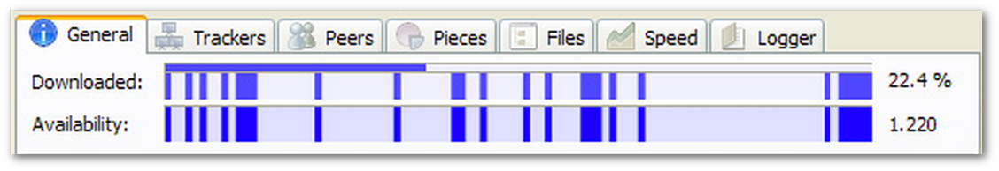

What is this?
-------------

Chunkybar is a data structure which efficiently represents multi-piece progress bars like those found in some bittorrent clients.

Below is an example of a multi-piece progress bar in uTorrent:

How does it work?
-----------------

See chunkybar.h and the 30 tests within tests/test_chunkybar.c

Building
--------
$make
